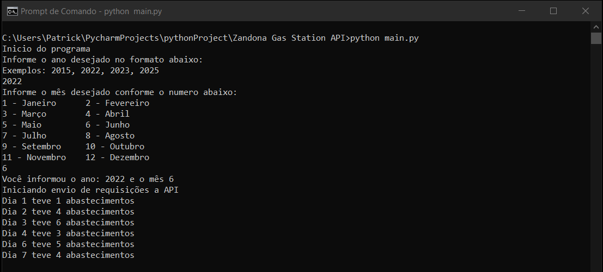
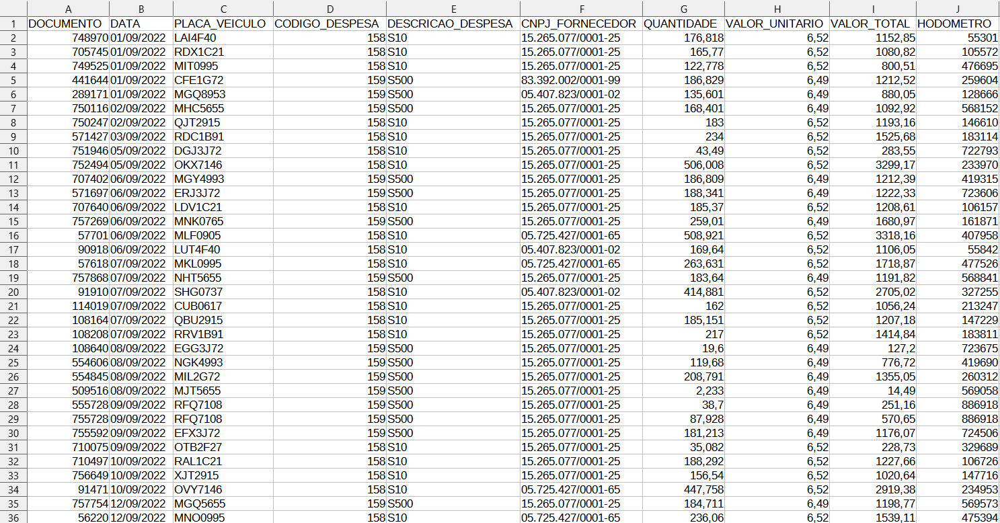

# Zandona-API-Integration

This program was created with the goal of fully automating the process of registering truck fuelling in a company system.

The project was developed using Pandas for data manipulation and Requests for connection with the API provided by the Zandoná gas station network.

The program execution steps are:

1. Select the desired year and month to import
2. Connect to the API and send the requests
3. Organize and filter the returned data
4. Save the data in a new excel file

After that, the generated file can be imported into the desired System for use.

Program Start:

Resulting file:

